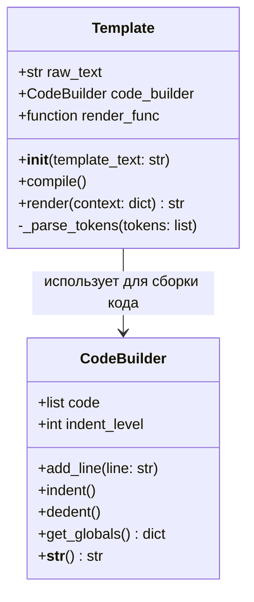
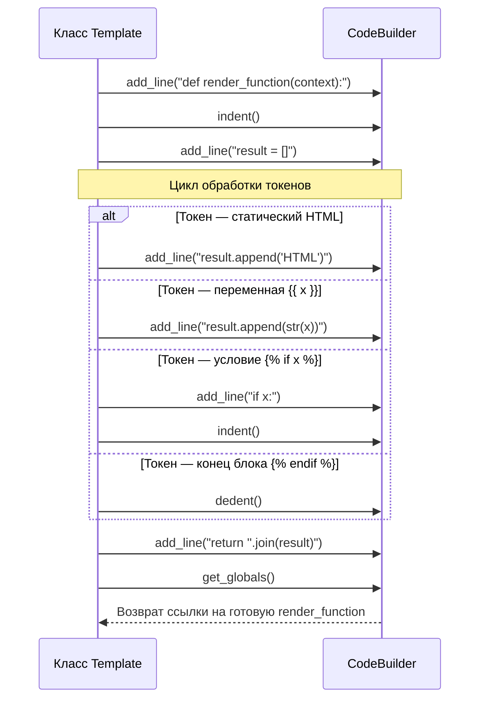
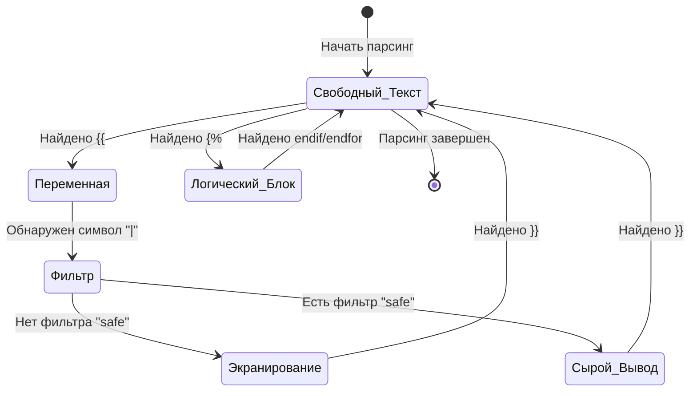

# Разработка компилирующего шаблонизатора (Template Engine) с нуля на Python

Данное техническое руководство содержит описание процесса исследования предметной области, проектирования архитектуры и пошавого создания собственного компилирующего шаблонизатора на языке Python. Руководство ориентировано на начинающих разработчиков и содержит подробные объяснения, примеры кода и визуальные схемы.

---

## 1. Исследование предметной области

**Шаблонизатор (Template Engine)** — это специализированный инструмент, который объединяет статическую текстовую разметку (шаблон HTML/CSS) с динамическими данными (контекстом) для генерации финального документа.

При разработке шаблонизаторов применяют два основных подхода:

1. **Интерпретирующий подход:** Движок парсит шаблон в дерево токенов и при каждом запросе выполняет циклы замены текста. Этот метод прост в реализации, но непроизводителен.
2. **Компилирующий подход (Кодогенерация):** Движок динамически преобразует синтаксис шаблона в валидный код на языке Python (создает функцию рендеринга "на лету"), компилирует его один раз с помощью встроенной функции `exec()` и затем мгновенно выполняет. Это промышленный стандарт, обеспечивающий максимальную скорость генерации страниц.

---

## 2. Архитектура и структура данных

Процесс обработки шаблона состоит из четырех ключевых этапов, представленных на схеме ниже.

### Схема 1. Жизненный цикл шаблона (Data Flow)

```
                       [ Текст шаблона (HTML) ]
                                  │
                                  ▼
                ──────────────────────────────────────
               │         1. Лексический анализ        │
               │   Разбиение текста на токены через   │
               │         регулярные выражения         │
               └──────────────────────────────────────┘
                                  │
                                  ▼
                ──────────────────────────────────────
               │          2. Генерация кода           │
               │ Трансляция токенов в Python-инструкции│
               │       с помощью CodeBuilder          │
                ──────────────────────────────────────
                                  │
                                  ▼
                ──────────────────────────────────────
               │            3. Компиляция             │
               │  Вызов exec() для превращения кода   │
               │         в объект-функцию             │
                ──────────────────────────────────────
                                  │
                                  ▼
                     [ Готовая функция render() ]
                                  │
                                  ▼
                    [ Итоговый HTML-документ ]
```

Для построения системы мы спроектируем два класса:
* `CodeBuilder` — вспомогательный класс, отвечающий за сборку строк Python-кода с динамическим управлением отступами.
* `Template` — основной класс, выполняющий парсинг, компиляцию и рендеринг.

### Схема 2. UML-диаграмма классов шаблонизатора



---

## 3. Пошаговая реализация технологии

### Шаг 1. Создание генератора кода (`CodeBuilder`)

Так как язык Python чувствителен к отступам (индексации блоков), нам необходим инструмент, автоматизирующий добавление пробелов перед строками кода. Кроме того, при компиляции через `exec()` нам нужно явно передать в изолированное окружение внешние зависимости (модуль `html` для защиты от XSS и словарь `FILTERS` для обработки строк).

Создайте файл `engine.py` и добавьте туда класс `CodeBuilder`:

```python
import html

# Реестр доступных фильтров (будет использоваться далее)
FILTERS = {
    "upper": lambda x: str(x).upper(),
    "lower": lambda x: str(x).lower(),
    "reverse": lambda x: str(x)[::-1],
    "safe": lambda x: x
}

class CodeBuilder:
    """Управляет динамической генерацией Python-кода с соблюдением отступов."""
    def __init__(self):
        self.code = []          # Список строк генерируемого кода
        self.indent_level = 0   # Текущий уровень вложенности

    def add_line(self, line):
        """Добавляет строку кода с учетом текущего уровня отступа."""
        self.code.append("    " * self.indent_level + line)

    def indent(self):
        """Увеличивает отступ (вход в блок if, for, def)."""
        self.indent_level += 1

    def dedent(self):
        """Уменьшает отступ (выход из блока)."""
        self.indent_level -= 1

    def get_globals(self):
        """Компилирует накопленный код и возвращает глобальное пространство имен."""
        code_string = str(self)
        
        # Передаем импортированный html и словарь FILTERS внутрь контекста exec()
        # Это предотвращает ошибку NameError при выполнении скомпилированного кода
        global_vars = {
            "html": html,
            "FILTERS": FILTERS
        }
        
        exec(code_string, global_vars)
        return global_vars

    def __str__(self):
        return "\n".join(self.code)
```

---

### Шаг 2. Лексический анализ (Токенизация)

Нам необходимо разбить сплошной текст шаблона на отдельные смысловые блоки (токены): обычный HTML-текст, вывод переменных `{{ ... }}` и логические инструкции ``.

### Схема 3. Процесс токенизации строки

```
Входная строка: "Привет, {{ user }}!  Рады видеть! "
                                 │
                                 ▼ Парсинг регулярным выражением (re.split)
Токены на выходе:
 ───┬──────────────────────┬──────────────────────────────────────────────────
│ # │ Тип токена           │ Значение                                         │
├───┼──────────────────────┼──────────────────────────────────────────────────┤
│ 1 │ Обычный текст        │ "Привет, "                                       │
│ 2 │ Переменная           │ "{{ user }}"                                     │
│ 3 │ Обычный текст        │ "! "                                             │
│ 4 │ Начало условия       │ ""                                │
│ 5 │ Обычный текст        │ " Рады видеть! "                                 │
│ 6 │ Конец условия        │ ""                                    │
 ───┴──────────────────────┴──────────────────────────────────────────────────
```

---

### Шаг 3. Реализация компилятора и транслятора токенов

Основная задача компилятора — пройти по списку токенов и сгенерировать функцию на Python следующего вида:

```python
def render_function(context):
    result = []
    # (Здесь динамически собирается контент)
    return "".join(result)
```

### Схема 4. Диаграмма последовательности генерации кода



Добавьте в файл `engine.py` класс `Template`:

```python
import re

class Template:
    def __init__(self, template_text):
        self.raw_text = template_text
        self.code_builder = CodeBuilder()
        self.render_func = None
        self.compile()

    def compile(self):
        # Разбиваем текст по тегам {{ ... }} и 
        tokens = re.split(r"(\{\{.*?\}\}|\{\%.*?\%\})", self.raw_text, flags=re.DOTALL)
        
        # Сигнатура генерируемой функции
        self.code_builder.add_line("def render_function(context):")
        self.code_builder.indent()
        self.code_builder.add_line("result = []")
        
        # Переносим переменные из словаря context в локальную область видимости Python
        self.code_builder.add_line("for key, val in context.items():")
        self.code_builder.indent()
        self.code_builder.add_line("globals()[key] = val")
        self.code_builder.dedent()
        
        # Трансляция токенов
        self._parse_tokens(tokens)
        
        self.code_builder.add_line("return ''.join(result)")
        self.code_builder.dedent()
        
        # Компилируем собранный текст в исполняемый объект функции
        compiled_globals = self.code_builder.get_globals()
        self.render_func = compiled_globals["render_function"]

    def _parse_tokens(self, tokens):
        for token in tokens:
            if not token:
                continue
            
            # Если это вывод переменной: {{ user.name }}
            if token.startswith("{{"):
                var_name = token[2:-2].strip()
                self.code_builder.add_line(f"result.append(str({var_name}))")
                
            # Если это блок логики:  или 
            elif token.startswith("{%"):
                words = token[2:-2].strip().split()
                instruction = words[0]
                
                if instruction == "for":
                    loop_expr = " ".join(words[1:])
                    self.code_builder.add_line(f"for {loop_expr}:")
                    self.code_builder.indent()
                elif instruction == "if":
                    cond_expr = " ".join(words[1:])
                    self.code_builder.add_line(f"if {cond_expr}:")
                    self.code_builder.indent()
                elif instruction in ("endfor", "endif"):
                    self.code_builder.dedent()
                    
            # Если это обычный статический текст
            else:
                safe_text = repr(token)
                self.code_builder.add_line(f"result.append({safe_text})")

    def render(self, context):
        """Вызывает скомпилированную функцию с переданными данными."""
        return self.render_func(context)
```

---

## 4. Модификация технологии (Творческое задание)

Для демонстрации развития полученных навыков мы добавим в шаблонизатор две важные функции безопасности и постобработки данных:

1. **Автоматическое HTML-экранирование (XSS Protection):** Защита веб-страницы от внедрения вредоносных скриптов (`<script>alert("hack")</script>`) путем замены спецсимволов HTML на безопасные сущности (`&lt;`, `&gt;`).
2. **Конвейерные фильтры (Filters Pipeline):** Возможность форматирования вывода переменных с помощью символа трубы `|` (например: `{{ username | upper | reverse }}`).

### Схема 5. Диаграмма состояний парсера при обработке модификаций



### Код модифицированного шаблонизатора (`modified_engine.py`):

```python
class ModifiedTemplate(Template):
    def _parse_tokens(self, tokens):
        for token in tokens:
            if not token:
                continue
            
            # Обработка переменных с поддержкой фильтров и XSS-защиты
            if token.startswith("{{"):
                expression = token[2:-2].strip()
                
                if "|" in expression:
                    parts = expression.split("|")
                    var_name = parts[0].strip()
                    filters_list = [p.strip() for p in parts[1:]]
                    
                    # Генерируем цепочку вызовов фильтров
                    expr_str = var_name
                    is_safe = False
                    for f in filters_list:
                        if f == "safe":
                            is_safe = True
                            continue
                        if f in FILTERS:
                            expr_str = f"FILTERS['{f}']({expr_str})"
                    
                    # Если фильтр "safe" не применен, экранируем HTML по умолчанию
                    if not is_safe:
                        self.code_builder.add_line(f"result.append(html.escape(str({expr_str})))")
                    else:
                        self.code_builder.add_line(f"result.append(str({expr_str}))")
                else:
                    # Экранирование переменной по умолчанию
                    self.code_builder.add_line(f"result.append(html.escape(str({expression})))")
            
            # Логические блоки (без изменений)
            elif token.startswith("{%"):
                words = token[2:-2].strip().split()
                instruction = words[0]
                if instruction == "for":
                    self.code_builder.add_line(f"for {' '.join(words[1:])}:")
                    self.code_builder.indent()
                elif instruction == "if":
                    self.code_builder.add_line(f"if {' '.join(words[1:])}:")
                    self.code_builder.indent()
                elif instruction in ("endfor", "endif"):
                    self.code_builder.dedent()
            
            # Статический текст
            else:
                safe_text = repr(token)
                self.code_builder.add_line(f"result.append({safe_text})")
```

---

## 5. Тестирование и верификация работоспособности

Для проверки работоспособности используется демонстрационный скрипт, тестирующий безопасность вывода и применение цепочек фильтров:

```python
if __name__ == "__main__":
    # Тестовые данные (контекст)
    test_context = {
        "user_input": "<script>alert('xss')</script>", # Опасный ввод пользователя
        "items": ["Молоко", "Хлеб", "Сыр"],
        "is_authorized": True
    }

    # HTML-шаблон
    html_layout = """
    <div>
        <h3>Профиль пользователя</h3>
        <p>Безопасный вывод имени: {{ user_input }}</p>
        <p>Вывод имени с фильтром REVERSE: {{ user_input | reverse }}</p>
        <p>Вывод неэкранированного HTML: {{ user_input | safe }}</p>

        
            <h4>Ваш список покупок:</h4>
            <ul>
                
                    <li>{{ item | upper }}</li>
                
            </ul>
        
    </div>
    """

    print("=== Инициализация шаблонизатора ===")
    template = ModifiedTemplate(html_layout)
    
    print("\n=== Сгенерированный Python-код функции рендеринга: ===")
    print(template.code_builder)
    
    print("\n=== Результат выполнения рендеринга (HTML): ===")
    output_html = template.render(test_context)
    print(output_html)
```

Запустите код командой `python modified_engine.py`. В выводе вы увидите сгенерированный скрипт функции и итоговую страницу HTML, где теги скрипта были заменены на безопасные сущности `&lt;script&gt;`, что подтверждает полную работоспособность разработанного движка и успешную реализацию защиты.